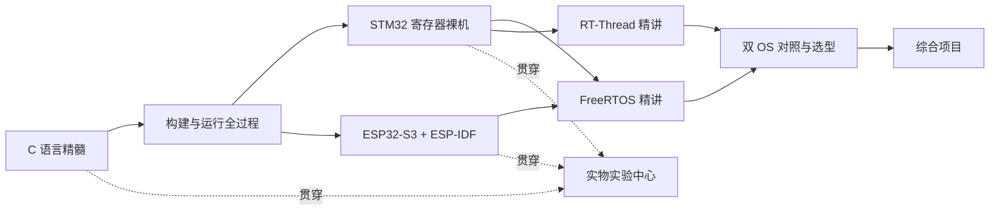

# 通往单片机之路

> 把一颗芯片讲透：寄存器级 STM32F407 × ESP32-S3 双路线 · C 语言精髓 · RTOS 双精讲 · 全程实物实验

受[通往AGI之路](https://waytoagi.feishu.cn/)启发——像它讲 AI 一样讲单片机：开源、体系化、面向初学者，但**不浅**。我们的信条是"挖掘精髓"：每一个知识点都要追到寄存器、追到源码、追到示波器上的波形。

## 为什么不一样

| 常见教程 | 本项目 |
|---|---|
| 调库点灯 | 手写启动文件、链接脚本，从 0x08000004 讲到你点亮它 |
| "本章将介绍……" | 每章一个钩子开场，先见现象，再挖原理 |
| 复制粘贴能跑就行 | 四件套：功能配置图解 + 引脚设置 + 库源码逐行解析 + 代码逐行分析 |
| RTOS 讲讲 API | FreeRTOS 内核源码级 + RT-Thread 精讲，上下文切换画成动画 |
| 纸上谈兵 | 每个实验都能在真实板卡上复现，配 SVG 接线图与实测要点 |
| 一条线从头滚到尾 | 首页学习地图按成稿状态显示全站进度，五类读者各有分流路线 |

## 从通往AGI之路借来的三件事

- **开源、体系化、面向初学者**：Apache-2.0 全开放，板块按依赖关系组织，导览先讲"这条路怎么走"；
- **一张不断更新的地图，而不是线性课程**：成稿/建设中一目了然，不用等"写完了再看"；
- **名词解释与常见问题前置**：[术语速查](docs/reference/glossary.md) 与 [FAQ](docs/reference/faq.md) 把卡住新人的词先解决掉。

不借的一件事：不把深度让渡给广度。这里只讲一颗芯片，所以每个知识点都要追到寄存器位、源码行号与实测波形。

## 基准板卡（作者实持，全部实验可复现）

- **野火 STM32F407 霸天虎**（F407ZGT6）——STM32 寄存器主线；RGB 红灯 PF6/绿 PF7/蓝 PF8
- **立创·实战派 ESP32-S3**（小智板，N16R8：16MB Flash + 8MB PSRAM）——ESP-IDF 主线

## 路线图



## 目录

```
docs/            VitePress 站点（全部教程内容）
├── guide/       导读：怎么学 / 实物装备 / 手册地图
├── c/           C 语言精髓（8 章）
├── build/       构建与运行全过程（8 章）
├── stm32/       STM32F407 寄存器主线（17 章）
├── rtos/        FreeRTOS + RT-Thread 双精讲 + 对照（19 章）
├── esp32/       ESP32-S3 + ESP-IDF（13 章）
├── gd32/        GD32 双系对照（G 篇 ARM / V 篇 RISC-V，建设中）
├── lab/         实物实验中心（模板 + 8 个实验）
└── reference/   术语速查 / FAQ / 更新日志 / 关于我们与致谢
code/            与章节同构的示例代码（寄存器版，全部逐行注释）
scripts/         gen-progress.mjs —— 扫全站章节 frontmatter 生成进度数据
```

各板块标注的是**规划章数**；已成稿几篇由脚本统计，见下。

## 本地预览

```bash
npm install
npm run docs:dev      # http://localhost:5173（自动先跑 docs:gen 生成进度数据）
npm run docs:build    # 产出 docs/.vitepress/dist
npm run docs:gen      # 只跑统计：成稿章节/实验/动画/工程数 + 元数据缺项告警
```

## 参与贡献

章节成稿、动画制作、实物实验、勘误都欢迎——先读 [CONTRIBUTING.md](CONTRIBUTING.md)（内容深度标准、风格契约、动画与图片规范都在里面）。

## 状态

🚧 下面的数字由 `npm run docs:gen` 扫章节 frontmatter 得出（最后一次核对：2026-10-06）：

- **成稿章节 21 / 规划 66**：S×7 · F×7 · P×4 · G×1 · B×1 · C×1，其余为骨架页（结构、学习目标、先修已定，正文待补）；
- **实物实验 8 / 8**（E01–E08）、**机制动画 29 张**、**可构建示例工程 11 个**；
- 首页地图实心=成稿、虚线=建设中；GD32 双系路线（G 篇 ARM GD32F4xx / V 篇 RISC-V GD32VF103）建设中，G1 RCU 时钟树已成稿；
- 未回填的事实一律在页面上标"待核验/待上板实测"（如 GD32 的 FMC 等待表、MCO1 输出频率），请勿当已验证数据引用。

## License

[Apache-2.0](LICENSE)
