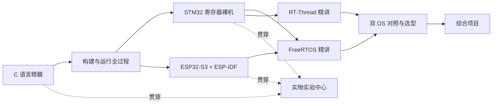

# 通往单片机之路

> 把一颗芯片讲透：寄存器级 STM32F407 × ESP32-S3 双路线 · C 语言精髓 · RTOS 双精讲 · 全程实物实验

受[通往AGI之路](https://waytoagi.feishu.cn/)启发——像它讲 AI 一样讲单片机：开源、体系化、面向初学者，但**不浅**。我们的信条是"挖掘精髓"：每一个知识点都要追到寄存器、追到源码、追到示波器上的波形。

[](https://github.com/zhuguang-ZFG/mcu/actions/workflows/deploy.yml)
[](https://github.com/zhuguang-ZFG/mcu/actions/workflows/quality.yml)
[](#许可)
[](https://github.com/zhuguang-ZFG/mcu/commits/main)

**在线站点：<https://zhuguang-zfg.github.io/mcu/>** —— 读书去那里。本页是**仓库地图**：内容有入口、代码在哪、规范在哪、怎么在本地跑起来。

⚠️ **这是学习材料，不是安全或选型依据。** 引脚、阈值、时序以芯片 datasheet 为准；凡是没接仪器量过的现象，页面上一律写「待上板实测」，请不要当已验证数据引用。

## 从这里开始（零基础）

**第一步，就做这一件。** 大约 30 分钟：照 [S0 环境搭建：裸机工具链](docs/stm32/00-env.md) 把 `arm-none-eabi-gcc` 装好，把 [code/stm32/00-blink](code/stm32/00-blink) 编译出 `blink.bin`——**没有开发板也能做完这一步**，看到的已经是真机器码。做完再进 [实验 E01 点亮霸天虎的 RGB 红灯](docs/lab/e01-blink.md)，那一节才需要板子。

英文不好也能走：主线正文全是中文，手册原文只在"依据"处出现，并给出手册编号与页码。

### 备选入口

🧭 [导读：这条路怎么走](docs/guide/index.md) · 🗺️ [首页学习地图](docs/index.md) · 🔧 [实物装备清单](docs/guide/hardware.md) · 📖 [手册与资料地图](docs/guide/manuals.md) · 🔤 [术语速查](docs/reference/glossary.md) · ❓ [常见问题](docs/reference/faq.md) · 📣 [更新日志](docs/reference/changelog.md) · 🤝 [关于我们与致谢](docs/reference/about.md)

💻 [示例代码目录](code/) · 🎬 [动画规范与自检](.trellis/spec/docs-site/animation.md) · ✍️ [写作结构规范](.trellis/spec/docs-site/structure.md) · 🧩 [实验报告模板](docs/lab/template.md) · 🛠️ [参与共建](CONTRIBUTING.md) · 🐛 [提 Issue](https://github.com/zhuguang-ZFG/mcu/issues)

## 板块进度与入口

下表与[首页学习地图](docs/index.md)同源，由 `npm run readme:sync` 扫章节 frontmatter 生成；`npm run readme:check` 会在两边数字漂移时报错。**不要手改这一块的数字。**

<!-- readme:progress:start -->
| 板块 | 成稿 / 规划（已建档） | 现在就能点进去读 |
|---|---|---|
| [C 语言精髓](docs/c/index.md) | 7 / 8（8） | [C0 为什么嵌入式 C 是另一种 C](docs/c/00-c-in-mcu.md) · [C1 内存模型](docs/c/01-memory-model.md) · [C2 指针](docs/c/02-pointer.md) · [C3 volatile](docs/c/03-volatile.md) · [C4 结构体与 ABI](docs/c/04-struct-abi.md) · [C5 函数指针、状态机与环形缓冲](docs/c/05-func-pointer.md) · [C6 调用约定与栈帧](docs/c/06-abi-stack.md) |
| [构建与运行全过程](docs/build/index.md) | 4 / 8（8） | [B1 四步构建](docs/build/01-four-steps.md) · [B2 ELF 解剖](docs/build/02-elf.md) · [B3 链接脚本](docs/build/03-linker-script.md) · [B4 启动过程](docs/build/04-startup.md) |
| [STM32F407 寄存器主线](docs/stm32/index.md) | 12 / 17（17） | [S0 环境搭建](docs/stm32/00-env.md) · [S1 F407 架构总览](docs/stm32/01-arch.md) · [S2 RCC 时钟树](docs/stm32/02-rcc-clock.md) · [S3 GPIO](docs/stm32/03-gpio.md) · [S4 NVIC 与 EXTI](docs/stm32/04-nvic-exti.md) · [S5 SysTick](docs/stm32/05-systick.md) · [S6 定时器 TIM](docs/stm32/06-tim.md) · [S7 USART](docs/stm32/07-usart.md) · [S8 DMA](docs/stm32/08-dma.md) · [S9 ADC](docs/stm32/09-adc.md) · [S11 I2C](docs/stm32/11-i2c.md) · [S16 HardFault 与排错](docs/stm32/16-debug-hardfault.md) |
| [FreeRTOS 精讲](docs/rtos/index.md) | 9 / 9（9） | [F0 为什么需要 RTOS](docs/rtos/freertos/00-why-rtos.md) · [F1 任务与 TCB](docs/rtos/freertos/01-task-tcb.md) · [F2 上下文切换](docs/rtos/freertos/02-context-switch.md) · [F3 调度器](docs/rtos/freertos/03-scheduler.md) · [F4 队列](docs/rtos/freertos/04-queue.md) · [F5 信号量与互斥量](docs/rtos/freertos/05-sem-mutex.md) · [F6 任务通知、事件组与软件定时器](docs/rtos/freertos/06-notify-event-timer.md) · [F7 内存管理](docs/rtos/freertos/07-heap.md) · [F8 移植 FreeRTOS 到霸天虎](docs/rtos/freertos/08-port-f407.md) |
| [RT-Thread 精讲](docs/rtos/index.md) | 0 / 8（8） | _骨架页已建档，正文待补_ |
| [双 OS 对照与选型](docs/rtos/index.md) | 0 / 2（2） | _骨架页已建档，正文待补_ |
| [ESP32-S3 + ESP-IDF](docs/esp32/index.md) | 7 / 13（13） | [P0 环境搭建](docs/esp32/00-env.md) · [P1 S3 架构与启动](docs/esp32/01-arch-boot.md) · [P2 GPIO 与引脚矩阵](docs/esp32/02-gpio-matrix.md) · [P3 IDF 工程解剖](docs/esp32/03-idf-anatomy.md) · [P4 中断与双核](docs/esp32/04-irq-dualcore.md) · [P5 UART 驱动解析](docs/esp32/05-uart-driver.md) · [P7 定时器与 LEDC](docs/esp32/07-timer-ledc.md) |
| [GD32 双系对照](docs/gd32/index.md) | 1 / 10（1） | [G1 RCU 时钟树](docs/gd32/01-rcu-clock.md) |
| [实物实验中心](docs/lab/index.md) | 6 / 8（8） | [实验 E01 点亮霸天虎的 RGB 红灯](docs/lab/e01-blink.md) · [实验 E02 逻辑分析仪抓 UART 帧](docs/lab/e02-logic-uart.md) · [实验 E03 示波器看 PWM](docs/lab/e03-scope-pwm.md) · [实验 E05 I2C 抓包读 EEPROM](docs/lab/e05-i2c-eeprom.md) · [实验 E07 S3 板载姿态传感器](docs/lab/e07-qmi8658.md) · [实验 E08 S3 音频链路放音](docs/lab/e08-audio-play.md) |

- 成稿章节 **40 / 75**（上表「实物实验」那一行的 6 篇另计，不进章节数），通读约 **1570 分钟**（≈ 26.2 小时）；
- 实物实验 **6 / 8**（文稿成稿；完整配套工程 6 项，上板验证 0 项）；
- 机制动画 **42** 张，在 `docs/public/anim/`，动效与版式规范见 `.trellis/spec/docs-site/animation.md`；
- 示例工程 **32** 个，在 `code/`，与章节同构；
- 章节 frontmatter 元数据校验已通过（缺项或非法值会阻止构建）。
<!-- readme:progress:end -->

## 为什么不一样

| 常见教程 | 本项目 |
|---|---|
| 调库点灯 | 手写启动文件、链接脚本，从 0x08000004 讲到你点亮它 |
| "本章将介绍……" | 每章一个钩子开场，先见现象，再挖原理 |
| 复制粘贴能跑就行 | 四件套：功能配置图解 + 引脚设置 + 库源码逐行解析 + 代码逐行分析 |
| RTOS 讲讲 API | FreeRTOS 内核源码级 + RT-Thread 精讲，上下文切换画成动画 |
| 纸上谈兵 | 每个实验都能在真实板卡上复现，配 SVG 接线图与实测要点 |
| 一条线从头滚到尾 | 首页学习地图按成稿状态显示全站进度，五类读者各有分流路线 |
| 数字靠手写 | 成稿数 / 动画数 / 工程数由脚本扫描产出，README、首页、贡献指南同源 |

## 从通往AGI之路借来的三件事

- **开源、体系化、面向初学者**：Apache-2.0 全开放，板块按依赖关系组织，导览先讲"这条路怎么走"；
- **一张不断更新的地图，而不是线性课程**：成稿/建设中一目了然，不用等"写完了再看"；
- **名词解释与常见问题前置**：[术语速查](docs/reference/glossary.md) 与 [FAQ](docs/reference/faq.md) 把卡住新人的词先解决掉。

不借的一件事：不把深度让渡给广度。这里只讲一颗芯片，所以每个知识点都要追到寄存器位、源码行号与实测波形。

## 基准板卡（作者实持，全部实验可复现）

- **野火 STM32F407 霸天虎**（F407ZGT6）——STM32 寄存器主线；RGB 红灯 PF6 / 绿 PF7 / 蓝 PF8
- **立创·实战派 ESP32-S3**（小智板，N16R8：16MB Flash + 8MB PSRAM）——ESP-IDF 主线
- **GD32 双系**（G 篇 GD32F4xx / V 篇 GD32VF103）——与 STM32F407 逐字段对照，建设中

## 路线图



## 仓库结构

```
docs/                        VitePress 站点（全部教程内容，base 为 /mcu/）
├── index.md                 首页：学习地图 + 按身份分流
├── guide/                   导读：怎么学 / 实物装备 / 手册地图
├── c/                       C 语言精髓
├── build/                   构建与运行全过程
├── stm32/                   STM32F407 寄存器主线
├── rtos/                    FreeRTOS + RT-Thread 双精讲 + 对照
├── esp32/                   ESP32-S3 + ESP-IDF
├── gd32/                    GD32 双系对照（G 篇 ARM / V 篇 RISC-V）
├── lab/                     实物实验中心（模板 + 8 个实验）
├── reference/               术语速查 / FAQ / 更新日志 / 关于我们与致谢
└── public/anim/             34 张 SMIL 机制动画（构建期内联进页面）
code/                        与章节同构的示例工程（寄存器版，全部逐行注释）
├── stm32/ esp32/ rtos/ c/ gd32/
└── toolchain/               不需要开发板的取证工程（如 02-elf；stm32/01-arch、09-adc 也各带一个 probe.sh）
scripts/                     gen-progress.mjs · anim-lint.mjs · links-check.mjs · anim-audit.html
.trellis/spec/docs-site/     写作结构、内容风格、动画规范（条款尽量变成可执行检查）
.github/workflows/           deploy.yml（构建并发布 Pages）· quality.yml（死链 / 动画 / 数字 / 链接四道检查）
```

各板块标注的是**规划章数**；已成稿几篇由脚本统计，见上表。

## 本地预览与自检

```bash
npm install
npm run docs:dev        # http://localhost:5173（自动先跑 docs:gen）
npm run docs:build      # 验收门禁：站内死链检查开启，必须零错误
npm run docs:gen        # 只跑统计：成稿/实验/动画/工程数 + 元数据缺项告警
npm run anim:lint       # 动画规范闸门：SMIL 槽位、色板映射、dur 整除、指示点出界
npm run readme:sync     # 把扫描结果写回本页进度块
npm run readme:check    # 数字漂移检查（CI 跑这个）
npm run links:check     # 仓库根 README/CONTRIBUTING 的相对链接检查（CI 跑这个）
```

## 完整质量检查

~~~bash
npm run quality          # 单元回归、清单、站点、动画、统计与链接
npm run firmware:check   # 需 ARM GCC、宿主 GCC、make/sh、FreeRTOS V11.1.0
npx playwright install chromium
npm run test:browser     # 在 docs:build 后验证搜索、动画与移动端
npm run site:measure     # 原始/压缩体积与搜索按需加载记录
~~~

工程入口登记在 [code/projects.json](code/projects.json)。ESP32 构建由 CI 清单矩阵逐个使用 IDF 5.5.2 和 esp32s3 验证；各工程 README 给出本地命令。发布流程必须先通过同一提交的全部质量检查。

## 常见问题（FAQ）

完整版在站内 [FAQ](docs/reference/faq.md)，这里只答"在仓库里"才会问的。

**Q1 我没有开发板，能学什么？** [B2 ELF 解剖](docs/build/02-elf.md)、[C1 内存模型](docs/c/01-memory-model.md)、[C3 volatile](docs/c/03-volatile.md) 三篇成稿章节只用编译器与 `readelf`/`objdump`，不需要板子；取证脚本在 [code/toolchain/](code/toolchain/) 与 [code/c/](code/c/)，`sh probe.sh` 一条命令跑完。S1 位带与 S9 的 SAR 算法也各有 `probe.sh`（[code/stm32/01-arch/](code/stm32/01-arch/)、[code/stm32/09-adc/](code/stm32/09-adc/)）——一个查 `-O2` 反汇编，一个在宿主机把 12 轮二分的码值全算出来，动画里每个数字都出自它们；这两章的板上现象仍标着待接板回填。S0 环境搭建也是无板可做的（装工具链、编出 `blink.bin`）。

**Q2 为什么很多章节是空的？** 骨架页先建档（结构、学习目标、先修已定），正文按"能实测再写"的顺序补——写了就必须有出处，所以宁可标「建设中」也不预填结论。成稿进度见上表。

**Q3 页面上的数字可信吗？** 章节数、动画数、工程数由 `npm run docs:gen` 扫文件得出；正文里的字节数、地址、频率一律来自实测输出，能复跑。凡是没量过的现象标「待上板实测」。

**Q4 动画怎么看？** 章节正文里的动画在**站点**上是内联 SVG（构建期由 `` 自动内联成 `<AnimFigure>`），打开即播，随深浅主题换色：<https://zhuguang-zfg.github.io/mcu/>。本地单独看某一张，用浏览器直接打开 `docs/public/anim/xxx.svg` 即可。想批量检查版式（出界/压字），用 [scripts/anim-audit.html](scripts/anim-audit.html)，用法见 [动画规范 §7](.trellis/spec/docs-site/animation.md)。

**Q5 发现写错了怎么办？** 欢迎提 [Issue](https://github.com/zhuguang-ZFG/mcu/issues) 或按 [CONTRIBUTING.md](CONTRIBUTING.md) 直接提 PR——注明文件与小节、原文、应为、依据。本站自己的勘误记录在 [更新日志](docs/reference/changelog.md)，不偷偷改掉。

## 参与共建

- 先读 [CONTRIBUTING.md](CONTRIBUTING.md)：内容深度标准、四件套结构、风格契约、动画与图片规范。
- 写章节照 [章节结构规范](.trellis/spec/docs-site/structure.md)，做动画照 [动画规范](.trellis/spec/docs-site/animation.md)（改完跑 `npm run anim:lint`）。
- 补实验照 [实验报告模板](docs/lab/template.md)，未回填的现象统一标「待上板实测」。
- 小改动（错别字、死链）直接提 PR；CI 有三道闸门：死链、动画规范、数字与链接一致性。

## 许可

[Apache-2.0](LICENSE)

> AI生成