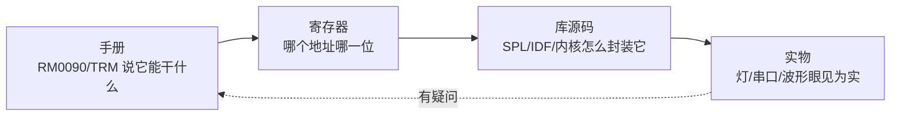
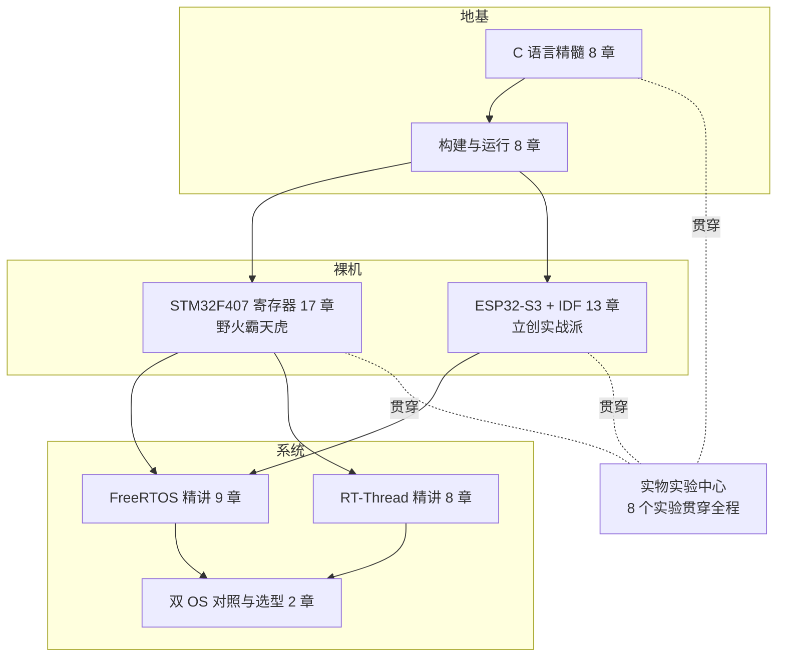

# 导读：这条路怎么走

> 🎯 学单片机最大的坑不是难，是"学了一堆碎片，拼不成整机"。本站的治疗方案：所有知识挂到一条主干上——从一行 C 代码到板子上的物理现象，中间的每一环都不跳过。

## 本站的学习循环

每一个知识点，走同一个四步循环：

跳步的代价：只看手册会背不会做；只会调库，现象一异常就抓瞎；不看实物，永远分不清"我以为"和"真的是"。

## 全景路线图

## 推荐走法

| 你的情况 | 走法 |
|---|---|
| 零基础，板子刚到 | [S0](../stm32/00-env.md) 或 [P0](../esp32/00-env.md) 先把灯点了（成就感先行）→ 回头按 C 篇 → B 篇 → 裸机顺序补地基 |
| 有 C 基础，玩过 Arduino | 直接从 B 篇开始，补上"构建/链接/启动"这块最常被跳过的地基，再进裸机 |
| 想直接啃 RTOS | 至少先读 [C6 调用约定](../c/06-abi-stack.md) 和 [S4 中断](../stm32/04-nvic-exti.md)，否则上下文切换看不懂在切什么 |

## 板块速查

| 板块 | 一句话 | 去 |
|---|---|---|
| C 语言精髓 | 嵌入式 C 是另一种 C | [C0](../c/00-c-in-mcu.md) |
| 构建与运行 | 你的代码经历了什么 | [B0](../build/00-toolchain.md) |
| STM32 | 寄存器级裸机 | [S0](../stm32/00-env.md) |
| ESP32 | IDF 与 S3 的里里外外 | [P0](../esp32/00-env.md) |
| FreeRTOS | 内核源码级剖析 | [F0](../rtos/freertos/00-why-rtos.md) |
| RT-Thread | 内核+设备框架+生态 | [R0](../rtos/rtthread/00-arch.md) |
| 实验中心 | 全部实验索引 | [lab](../lab/index.md) |

## 你做到了

读完本页：知道自己在地图上的位置，知道下一步点哪里。
