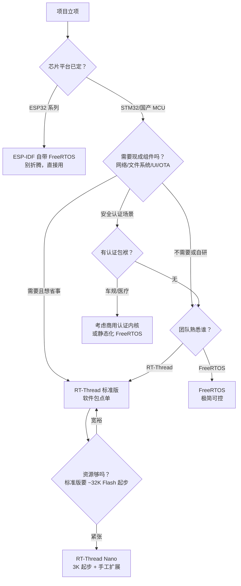

# 对比 1：选型决策树——什么项目牵谁的手

> 🎯 "FreeRTOS 还是 RT-Thread？"这个问题没有普世答案，只有"你的项目长什么样"。把项目特征当输入，顺着决策树走一遍，答案自然浮出来。

## 怎么读这一章

- **能记住**：选型三定律——"平台先定，生态其次，团队兜底"。
- **能理解**：为什么 ESP32 就用 IDF 自带 FreeRTOS（平台绑定，协议栈深度集成 SMP/电源管理）；为什么功能纯粹的控制器选 FreeRTOS 而要拼产品的选 RT-Thread 标准版。
- **能用**：拿到一个新项目立项，30 分钟内按决策树走一遍给出有依据的选型结论，不靠拍脑袋。

## 决策树

## 三句话版

1. **平台决定论**：ESP32 就用 IDF 自带 FreeRTOS（深度集成 SMP/电源管理），换 RTOS 是自找苦吃。
2. **生态决定论**：要快速拼出"联网+存储+UI+OTA"的产品，RT-Thread 的软件包中心能省几个月；反之功能纯粹的控制器，FreeRTOS 的极简更香。
3. **人决定论**：团队熟悉哪个用哪个——RTOS 的坑都长在"不熟悉"上；学习成本往往大于技术差异。

### 平台决定论：ESP32 为什么直接用 IDF 自带 FreeRTOS

ESP32 系列芯片的 Wi-Fi/BLE 协议栈、电源管理、双核 SMP 调度都深度集成在 ESP-IDF 里（[P4 中断与双核](../../esp32/04-irq-dualcore.md)），而 IDF 内置的就是 FreeRTOS（且是 SMP 适配版）。换 RTOS 意味着要把协议栈、电源管理、双核调度全部重新对接——工作量以人月计，且享受不到乐鑫的持续维护。所以 ESP32 的选型答案几乎是唯一的：**IDF 自带 FreeRTOS，别折腾**。

这背后的逻辑是"平台绑定"：芯片厂商把 RTOS 与 SDK 深度耦合，换 RTOS 的成本远大于换 RTOS 的收益。STM32/国产 MCU 没有这种绑定——FreeRTOS 和 RT-Thread 都能跑，选型才成为真问题。

### 生态决定论：什么时候 RT-Thread 软件包能省几个月

一个"带屏+联网+文件系统+OTA"的产品，从零搭起来需要：网络栈（LwIP/HTTP/MQTT）、文件系统（FatFS/LittleFS）、UI 框架（LVGL）、OTA 框架。这些在 RT-Thread 软件包中心（[R6 Env 与 menuconfig](../rtthread/06-env-menuconfig.md)）里都是 `menuconfig` 勾选 + `pkgs --update` 下载即用——加起来可能省几个月的开发时间。

反过来，功能纯粹的控制器（传感器采集+串口上报、电机驱动、简单状态机）不需要这些组件——FreeRTOS 的极简内核（几 KB Flash）更香，因为没有"杀鸡用牛刀"的生态开销。RT-Thread Nano（3KB 起步）也能做，但标准版的生态优势在这个场景用不上。

判断标准很朴素：**你的项目要碰"联网/存储/UI/OTA"里的几个？碰 3 个以上，RT-Thread 标准版的生态优势显著；碰 0-1 个，FreeRTOS 的极简更划算。**

### 人决定论：团队熟悉度往往大于技术差异

RTOS 的坑都长在"不熟悉"上：FreeRTOS 的优先级数值大=高、RT-Thread 数值小=高（[对比 0](00-side-by-side.md)），方向反了调度行为全反——这种坑只有"踩过一次"才记住。团队如果熟悉 FreeRTOS，切 RT-Thread 的学习成本（重新建心智模型 + 踩坑）往往大于两个 OS 之间的技术差异。

所以当平台和生态都没有压倒性倾向时（如 STM32 上做中等复杂度产品），**团队熟悉哪个用哪个**——这是最务实的选型。学习成本是真实的工程成本，不比技术差异小。

## 本项目场景练习

| 场景 | 建议 | 理由 |
|---|---|---|
| 霸天虎做传感器采集+串口上报 | FreeRTOS | 功能纯粹，内核即够 |
| 霸天虎做带屏+文件系统+网络的终端 | RT-Thread 标准版 | 组件现成，生态提速 |
| 立创 S3 做小智语音终端 | ESP-IDF（FreeRTOS） | 平台绑定，协议栈深度集成 |
| 电池供电极简节点 | RT-Thread Nano 或 FreeRTOS | 两者皆可，看团队 |

### 场景练习的解读

四个场景覆盖了决策树的全部路径：

- **传感器采集+串口上报**：不碰联网/存储/UI/OTA（0 个组件），FreeRTOS 极简内核几 KB 就够，团队如果熟悉 FreeRTOS 直接选。RT-Thread Nano 也能做，但没有生态优势。
- **带屏+文件系统+网络终端**：碰 UI+存储+联网（3 个组件），RT-Thread 标准版的软件包能省几个月，生态优势压倒性。FreeRTOS 也能做但要自己拼 LwIP/FatFS/LVGL，工作量大。
- **小智语音终端**：平台绑定——S3 用 ESP-IDF，IDF 自带 FreeRTOS SMP 适配版，换 RTOS 是自找苦吃。协议栈+电源管理+双核调度都深度集成。
- **电池供电极简节点**：资源紧张（Flash < 32K）、功能纯粹，两者都能做——RT-Thread Nano 3K 起步、FreeRTOS 几 KB 起步，看团队熟悉度。这是"人决定论"的典型场景。

## 短自测

1. ESP32 项目为什么几乎一定用 IDF 自带 FreeRTOS？换 RTOS 的代价是什么？

看答案
ESP32 的 Wi-Fi/BLE 协议栈、电源管理、双核 SMP 调度都深度集成在 IDF 里，IDF 内置的就是 FreeRTOS SMP 适配版。换 RTOS 要把协议栈、电源管理、双核调度全部重新对接——工作量以人月计，且享受不到乐鑫的持续维护。换 RTOS 的成本远大于换 RTOS 的收益，所以"平台绑定"让选型答案几乎唯一。

2. 什么项目特征让你选 RT-Thread 标准版而不是 FreeRTOS？给出量化判断标准。

看答案
项目要碰"联网/存储/UI/OTA"组件中的 3 个以上——RT-Thread 标准版的软件包中心（menuconfig 勾选+pkgs --update）能省几个月。量化标准：数你的项目要用的组件数，碰 3 个以上选 RT-Thread 标准版（生态优势压倒性），碰 0-1 个选 FreeRTOS（极简无生态开销），碰 2 个看团队熟悉度。

3. "团队熟悉 FreeRTOS，新项目用 RT-Thread 会更好"——这个决策什么时候成立、什么时候不成立？

看答案
成立条件：RT-Thread 的生态优势（软件包省几个月）显著大于团队学习 RT-Thread 的成本（建心智模型+踩坑）——即项目要碰 3+ 个组件且团队愿意承担学习成本。不成立条件：项目功能纯粹（0-1 个组件），RT-Thread 的生态优势用不上，团队切 RT-Thread 只有学习成本没有收益——这时"团队熟悉哪个用哪个"更务实。学习成本是真实工程成本，不比技术差异小。

4. 决策树里"资源紧张"分支为什么推荐 RT-Thread Nano 而非标准版？Nano 与标准版的资源差是多少？

看答案
标准版要 ~32K Flash 起步（带 finsh+设备框架+组件），资源紧张（如 64K Flash 芯片）放不下或太挤。Nano 是 3K Flash 起步的裁剪版（只内核，无设备框架/finsh/组件），资源紧张时选 Nano 手工扩展需要的部分。Nano vs 标准版的资源差约 10 倍（3K vs 32K），差距来自组件层（设备框架/finsh/文件系统等）的有无。

5. 给"电池供电极简节点"场景，FreeRTOS 和 RT-Thread Nano 各有什么取舍点？

看答案
两者都能做（几 KB Flash、µA 级睡眠时 RTOS 开销可忽略）。FreeRTOS：极简、社区大、资料多、Tickless Idle（低功耗 tick）成熟；RT-Thread Nano：3K 起步、rt_object 可观测性好（list_thread）、与 RT-Thread 标准版平滑升级（产品后期要加组件可上标准版）。取舍：看团队熟悉度 + 产品后期是否会加组件——会加选 Nano（平滑升级路径），不会加两者皆可。

## 对照表：本章概念 → 仓库与上游落点

| 概念 | 落点 |
|---|---|
| 决策树（平台/生态/人三定律） | 本章决策树节 + 三句话版节 |
| 平台决定论（ESP-IDF 绑定） | [P4 中断与双核](../../esp32/04-irq-dualcore.md) SMP 适配 |
| 生态决定论（软件包省时） | [R6 Env 与 menuconfig](../rtthread/06-env-menuconfig.md) 软件包中心 |
| 配置哲学对照 | [对比 0](00-side-by-side.md) 机制深对照第三节 |
| Nano vs 标准版资源差 | [R0 架构](../rtthread/00-arch.md) Nano vs 标准版节 |
| 优先级方向迁移坑 | [对比 0](00-side-by-side.md) 常见坑第一节 |
| 场景练习四例 | 本项目霸天虎/S3 场景；[E01](../../lab/e01-blink.md)~[E08](../../lab/e08-audio-play.md) |

## 记忆锚点

::: tip 一句话记住
**平台先定，生态其次，团队兜底；要拼产品选生态，要抠资源选极简。**
:::

## 常见坑

- **为"学习目的"在 product 项目里换 RTOS**：学习用开发板随便换，产品线换 OS=全量回归测试。
- **低估 SMP 差异**：双核 S3 上 FreeRTOS 的核间亲和/互斥实现与单核不同——换核不审阅，灵异 bug 遍地（P4 联动）。
- **把生态当免费午餐**：软件包质量参差，生产用前读 issue/看维护频率——R6 教的方法用起来。
- **只看 Flash 占位不看 RAM**：标准版 32K Flash 起步，但 finsh+设备框架+多任务栈的 RAM 开销也要算——64K SRAM 芯片可能 Flash 够 RAM 紧。
- **选型时忽略调试可观测性**：RT-Thread 的 finsh `list_*` 命令在调试期极有价值（省接调试器的时间），量产可裁剪；FreeRTOS 靠 Tracealyzer/手动插桩——调试效率也是选型因素。

## 你做到了

- RTOS 篇收官：机制、移植、对照、选型四关全过；
- 下次立项，30 分钟内能给出有依据的选型结论。

✅ RTOS 篇收官。下一站：<a href="../../esp32/index.html">P 篇 ESP32-S3</a>——去双核+Wi-Fi 的世界里，看 FreeRTOS 的"出厂形态"。

