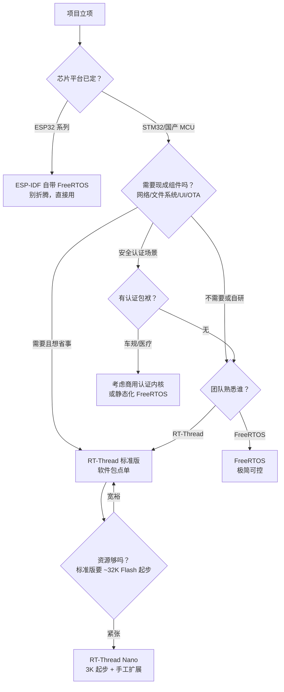

# 对比 1：选型决策树——什么项目牵谁的手

> 🎯 "FreeRTOS 还是 RT-Thread？"这个问题没有普世答案，只有"你的项目长什么样"。把项目特征当输入，顺着决策树走一遍，答案自然浮出来。

## 决策树

## 三句话版

1. **平台决定论**：ESP32 就用 IDF 自带 FreeRTOS（深度集成 SMP/电源管理），换 RTOS 是自找苦吃。
2. **生态决定论**：要快速拼出"联网+存储+UI+OTA"的产品，RT-Thread 的软件包中心能省几个月；反之功能纯粹的控制器，FreeRTOS 的极简更香。
3. **人决定论**：团队熟悉哪个用哪个——RTOS 的坑都长在"不熟悉"上；学习成本往往大于技术差异。

## 本项目场景练习

| 场景 | 建议 | 理由 |
|---|---|---|
| 霸天虎做传感器采集+串口上报 | FreeRTOS | 功能纯粹，内核即够 |
| 霸天虎做带屏+文件系统+网络的终端 | RT-Thread 标准版 | 组件现成，生态提速 |
| 立创 S3 做小智语音终端 | ESP-IDF（FreeRTOS） | 平台绑定，协议栈深度集成 |
| 电池供电极简节点 | RT-Thread Nano 或 FreeRTOS | 两者皆可，看团队 |

## 记忆锚点

::: tip 一句话记住
**平台先定，生态其次，团队兜底；要拼产品选生态，要抠资源选极简。**
:::

## 常见坑

- **为"学习目的"在 product 项目里换 RTOS**：学习用开发板随便换，产品线换 OS=全量回归测试。
- **低估 SMP 差异**：双核 S3 上 FreeRTOS 的核间亲和/互斥实现与单核不同——换核不审阅，灵异 bug 遍地（P4 联动）。
- **把生态当免费午餐**：软件包质量参差，生产用前读 issue/看维护频率——R6 教的方法用起来。

## 你做到了

- RTOS 篇收官：机制、移植、对照、选型四关全过；
- 下次立项，30 分钟内能给出有依据的选型结论。

✅ RTOS 篇收官。下一站：<a href="../../esp32/index.html">P 篇 ESP32-S3</a>——去双核+Wi-Fi 的世界里，看 FreeRTOS 的"出厂形态"。

